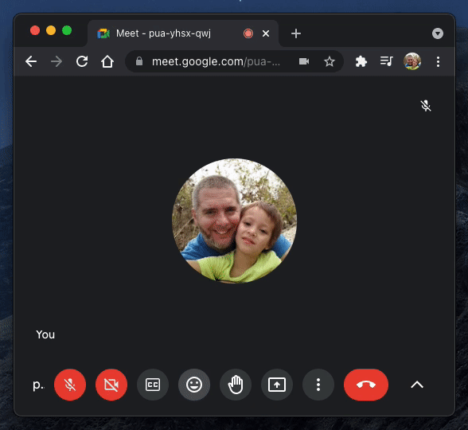

# Rejoinder
Google Meet emoji tool, inspired by Google's internal "MeetMoji" extension.

> **re·join·der**: noun; */rəˈjoindər/* 
> a reply, especially a sharp or witty one.

## How To Install

Go to the Chrome Web Store [extension page](https://chrome.google.com/webstore/detail/rejoinder/ppkljbmmakhcdfgokefgmologajbdima) and click `Add to Chrome`

## How To Use

Join a Google Meet meeting.  To the left of the "raise hand" button, you should see an emoji button which toggles the UI:

*Hint:* Keys `0` - `9` work as hotkeys.

## Animations

Some emojis have associated animations.

### Fireworks

### Party Poppers

### Stars

## Development

Click [here](DEV_README.md) for development notes if you want to contribute.

