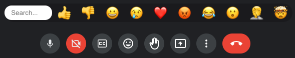

# Rejoinder
Google Meet emoji tool, similar to Google's internal "MeetMoji" extension.

> **re·join·der**: noun; */rəˈjoindər/* 
> a reply, especially a sharp or witty one.

## Install

**SOON:** Go to the [Chrome Web Store](https://chrome.google.com/webstore/detail/rejoinder/ppkljbmmakhcdfgokefgmologajbdima) and click "Add to Chrome".

*Link is not live yet pending extension review.  Follow [Install Extension Locally](DEV_README.md#install-extension-locally) instructions to get a preview.*

## How To Use

To the left of the "raise hand" button, you should see an emoji button which toggles the UI:

*Hint:* Keys `0` - `9` work as hotkeys.

## Development

Click [here](DEV_README.md) for development notes if you want to contribute.

